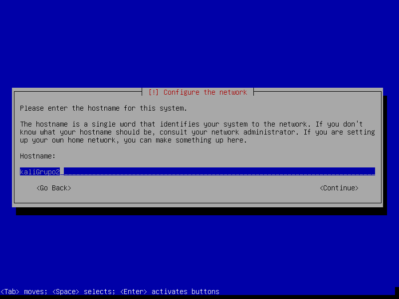
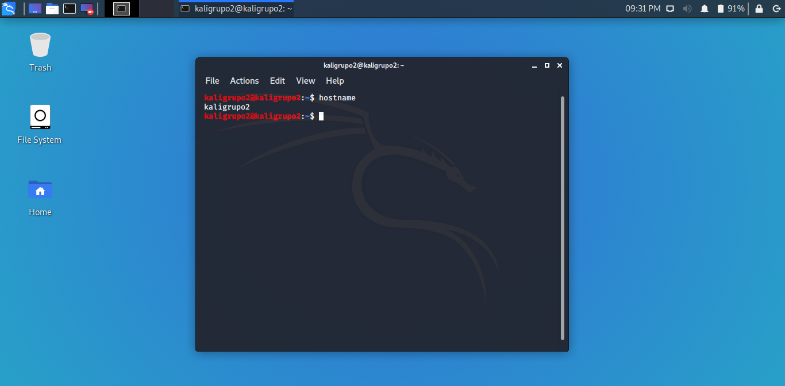
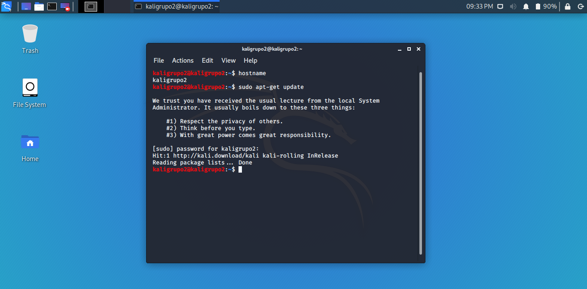
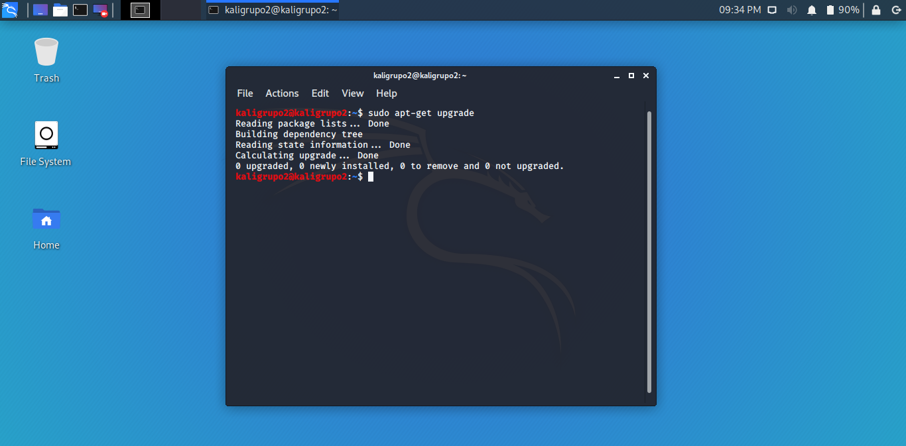
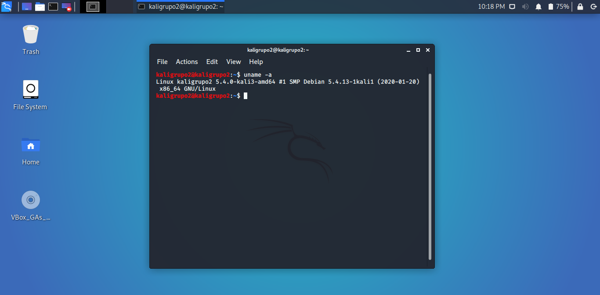
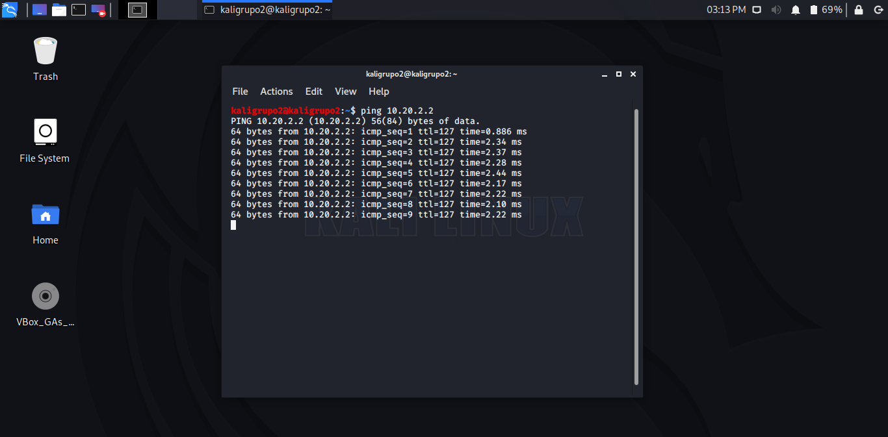

# Práctica 1: _Construir un ambiente de laboratorio_

## Evidencias de Kali Linux :dragon:

1. Nombre de host
>
>

2. Actualización del sistema operativo
>
>

3. Instalación de VirtualBox Guest Additions
>

4. Conectividad entre Kali y tarjeta ROJA de Smoothwall
>