# Práctica 1: _Construir un ambiente de laboratorio_

## Contenido:
+ [Evidencias Kali Linux](#kali)
    - Nombre de host
    - Actualización del sistema operativo
    - Instalación de VirtualBox Guest Additions
    - Conectividad entre Kali y tarjeta ROJA de Smoothwall
    
+ [Evidencias de Smoothwall](#smoothwall)
    - Imágenes de todo el proceso de instalación

+ Evidencias Windows XP
    - Direccionamiento IP
    - Configuraciones realizadas en SmoothWall
    - Aplicaciones instaladas
    - Instalación de VirtualBox Guest additions

+ Evidencia metasploitable:
    - Instalación
    - Conectividad entre metasploitable y:
        * Windows XP
        * SmoothWall

---
## Evidencias de Kali Linux :dragon:
### Kali
> 1. Nombre de host
>>>
>>>

> 2. Actualización del sistema operativo
>>>
>>>

> 3. Instalación de VirtualBox Guest Additions
>>>

> 4. Conectividad entre Kali y tarjeta ROJA de Smoothwall
>>>

---
## Evidencias de Smoothwall :construction:
### Smoothwall
>>>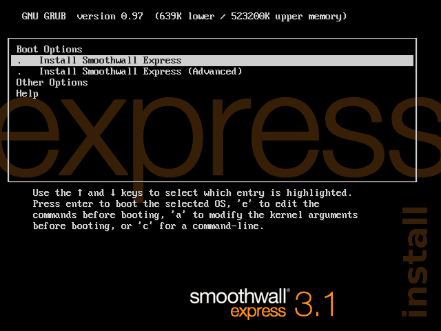
>>>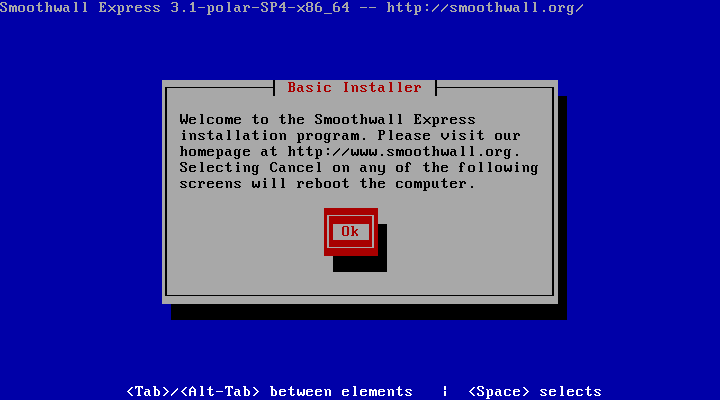
>>>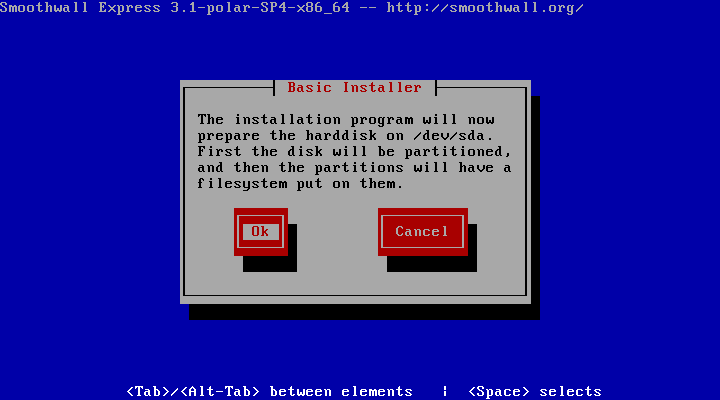
>>>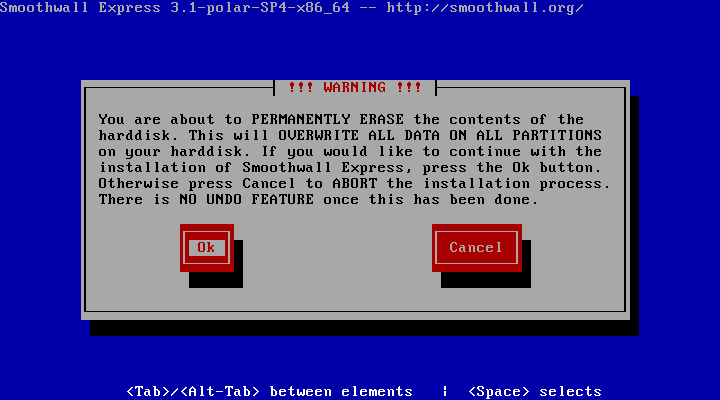
>>>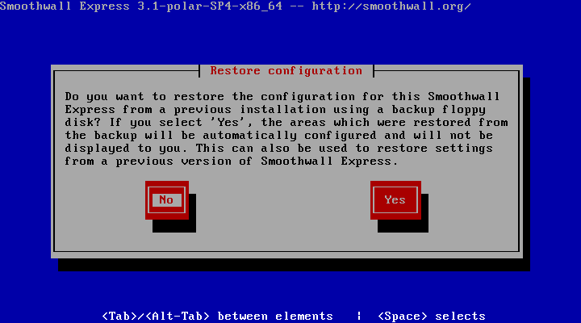
>>>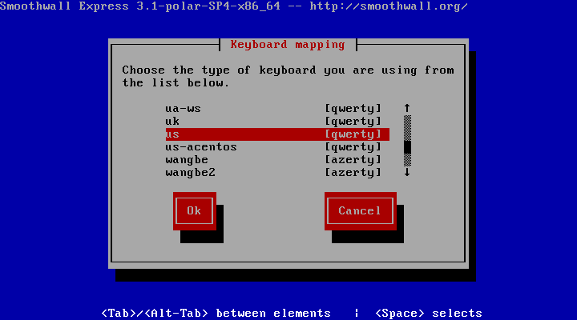
>>>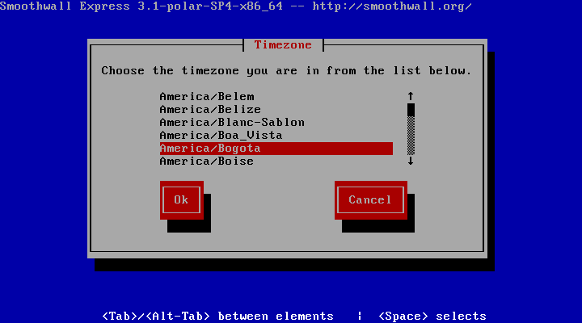
>>>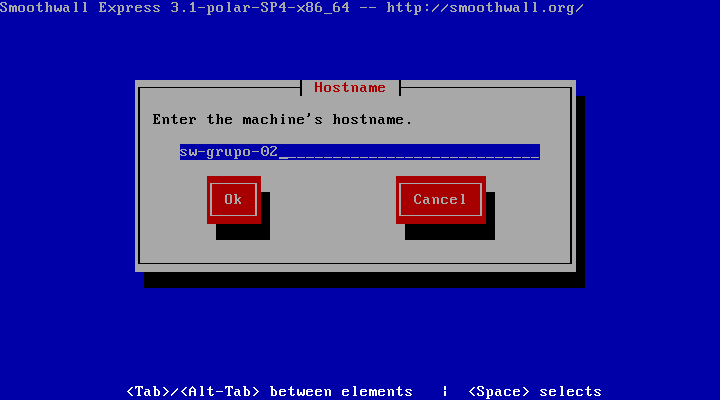
>>>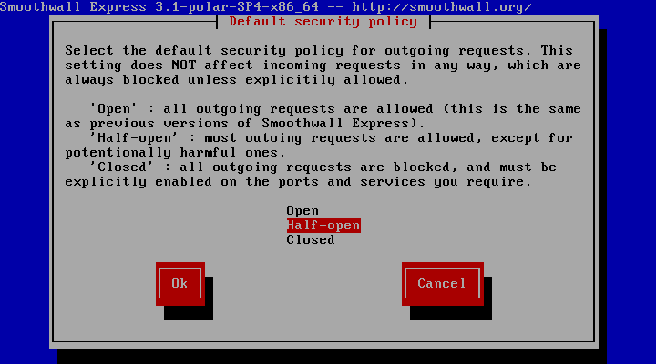
>>>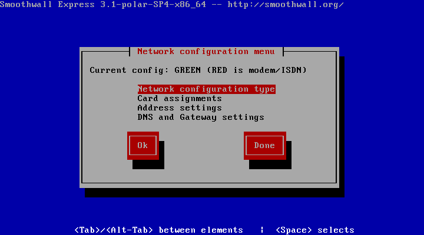
>>>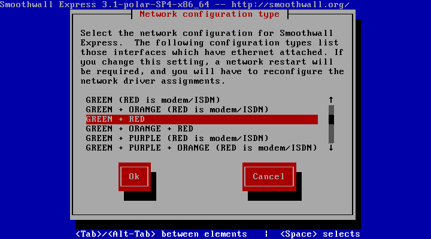
>>>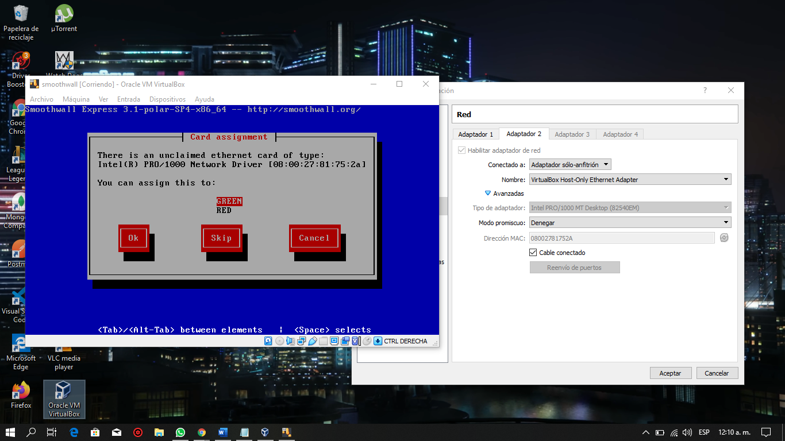
>>>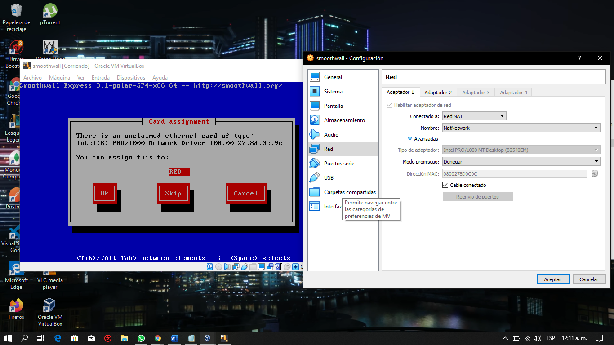
>>>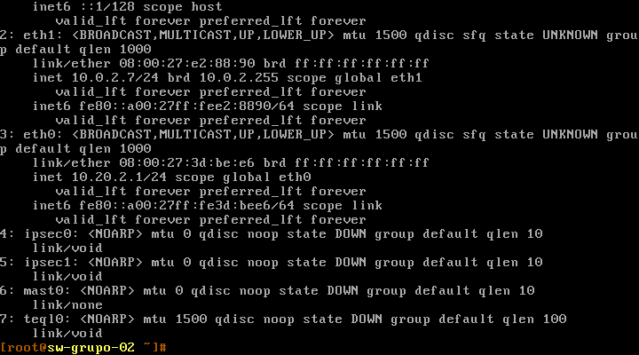
>>>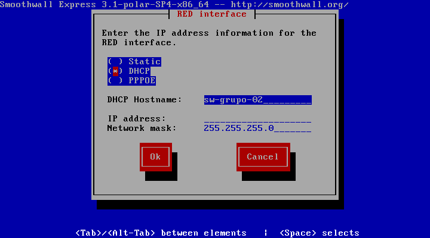
>>>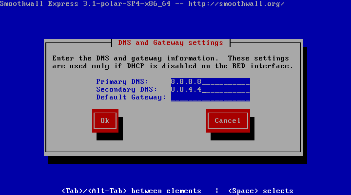
>>>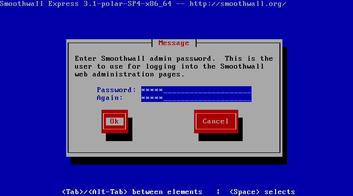